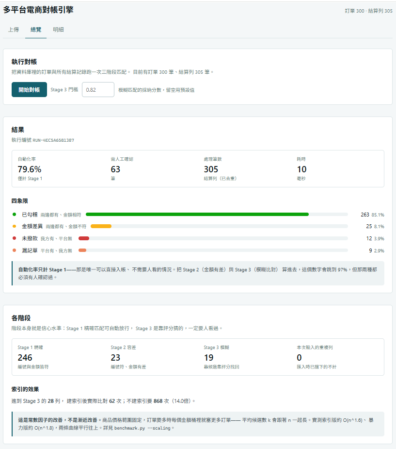
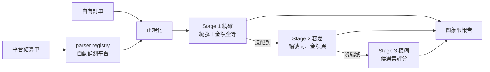
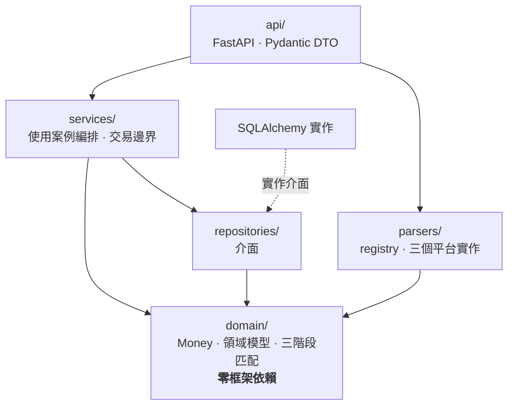
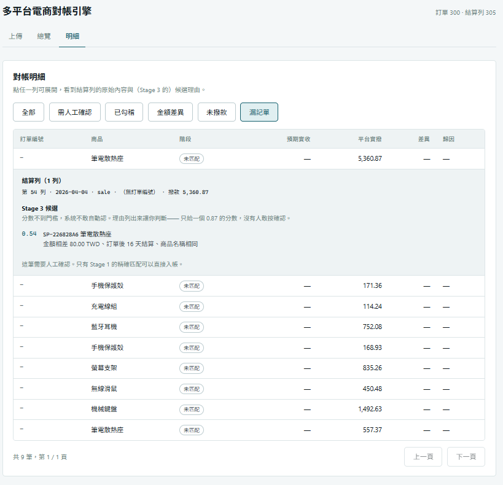
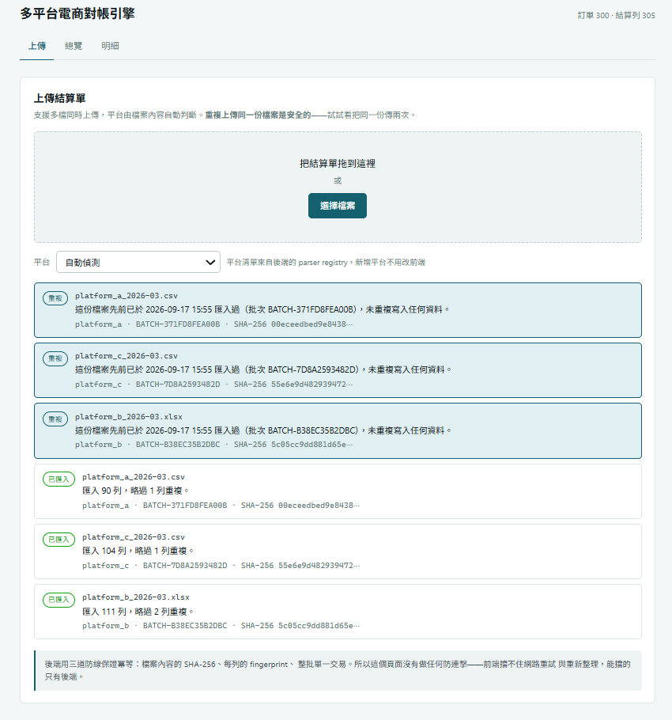

# 多平台電商對帳引擎

[](https://github.com/fush0528/AccountingAutomation/actions/workflows/ci.yml)


把電商賣家每月的手動對帳，從逐筆核對壓縮成一次上傳。
核心是可插拔的帳單解析層與三階段匹配演算法。



| 自動化率 | 處理速度 | 索引的效果 | 程式品質 |
|---|---|---|---|
| **79.6%** 可直接入帳 | 305 列 **6 ms** | Stage 3 比對次數 **14 倍** | mypy 嚴格模式 51 檔案零錯誤 |

上面每個數字都有 `scripts/benchmark.py` 拿 ground truth 逐項驗證，不是自己說了算。
第三個數字的對照基準與限制寫在[複雜度](#複雜度)一節——它是常數因子的改善，不是漸近改善。

---

## 60 秒跑起來

```bash
pip install -e ".[dev]"
python scripts/gen_fixtures.py                    # 產生三個平台的合成結算單
cd frontend && npm install && npm run build && cd ..
python scripts/serve.py                           # 開 http://127.0.0.1:8000
```

在「上傳」頁把 `data/generated/` 裡三個 `platform_*_2026-03.*` 拖進去，
到「總覽」按「開始對帳」。不想開網頁的話：

```bash
python scripts/benchmark.py        # 對帳 + ground truth 驗證，純終端機
python scripts/walkthrough.py      # 領域層導覽，解釋每個元件在做什麼
```

需求 Python 3.11 以上。Windows 上若 `pytest` 被安全性原則擋下，改用 `python -m pytest`。

## 問題

電商賣家在多個平台銷售，每個平台每月寄來一份結算單。賣家要確認：
平台撥的錢，跟自己系統裡的訂單對得起來嗎？

難在兩邊對不上的方式有很多種：

- 訂單編號格式不同（平台加了前綴、大小寫不一、混入全形字元）
- 金額有差（費率調整、運費補貼、部分退款）
- 有些結算列根本沒有訂單編號（平台端的調整與沖銷）
- 跨月結算讓日期錯開
- 每個平台的檔案格式、編碼、表頭結構、甚至「退款」的表示法都不一樣

所以這不是一句 SQL JOIN 能解決的問題。

## 做法



| 階段 | 條件 | 處理 |
|---|---|---|
| Stage 1 精確 | 正規化後編號與金額皆相符 | 自動勾稽，可直接入帳 |
| Stage 2 容差 | 編號相符、金額有差 | 計算差額並歸因（費率／運費／退款／捨入） |
| Stage 3 模糊 | 編號缺失或查無此單 | 日期窗口＋金額分桶建候選集，加權評分後進人工佇列 |

輸出分四個象限：**已勾稽**、**金額差異**、**漏記單**（平台有我方無）、
**未撥款**（我方有平台無）。

**階段本身就是信心水準。** 這是整個設計的核心——不是「配到／沒配到」的二分法，
而是「我有多確定」的分級。Stage 1 可以自動放行，Stage 3 一定要人看過。
候選索引的設計、評分權重、為何用貪婪而不是匈牙利演算法，寫在
[ADR 0002](docs/adr/0002-three-stage-matching.md)。

## 架構



只有一條硬規則：**`domain/` 不 import 任何框架**。沒有 FastAPI、沒有 SQLAlchemy、
沒有 pandas、沒有 openpyxl，只有標準函式庫。所以領域層的測試不需要資料庫，
跑完一輪不到 0.2 秒——因此真的會被跑。

**這條規則不是寫在 README 上自律，是寫成測試。**
`tests/architecture/test_layering.py` 用 AST 讀原始碼，檢查領域層只 import 標準
函式庫、每一層只依賴允許清單裡的內部層、全專案沒有原生 SQL。
規則腐爛的那一刻 CI 就會變紅。

`repositories/` 存在的唯一理由，是讓 SQLite 換成 PostgreSQL 只需要改連線字串。
這句話**已經被執行過**，不是被主張：

```bash
python -m pytest tests/api                                    # 記憶體 SQLite，24 passed
RECONCILIATION_TEST_DATABASE_URL="postgresql+psycopg://…" \
    python -m pytest tests/api                                # 真的 PostgreSQL 16，24 passed
```

理由、代價與四條架構測試的細節在
[ADR 0004](docs/adr/0004-layering-and-dependency-inversion.md)。

**自己實作的**是三階段匹配與候選集索引、`Money` 值物件、編號正規化與相似度評分、
三個平台的 parser 與 `sniff()`、差異歸因規則、冪等匯入的三道防線。
**用現成的**是 FastAPI、SQLAlchemy、Alembic、Pydantic、openpyxl、React、
TanStack Query、Hypothesis、openapi-typescript。

## 值得看的三件事

### 一、正確性寫在型別裡，不是寫在註解裡

**金額不用 `float`。** `Money` 以最小貨幣單位的整數儲存，捨入策略明確指定為
ROUND_HALF_UP。這是從 v1 的 `float` 改過來的，理由與代價寫在
[ADR 0001](docs/adr/0001-money-as-integer-minor-units.md)。

**非法狀態不可表示。** `MatchResult.__post_init__` 讓「MATCHED 卻沒有 order」
這種狀態根本無法被建構出來。與其在下游到處寫防禦性檢查，不如在型別層擋掉。
同理，缺失的訂單編號回傳 `None` 而非空字串——若都正規化成 `""`，
所有缺編號的記錄會在 Stage 1 互相匹配上，產生大量假的對帳結果。

**測試不只驗案例，還驗性質。** `tests/domain/test_properties.py` 用 Hypothesis
產生隨機輸入，驗證四條無論如何都必須成立的不變量：資料守恆、不重複認領、
金額一致、狀態合法。挑案例只能證明想到的情況是對的。

### 二、新增一個平台不用改既有程式

三個平台的檔案天差地遠，但解析出來都是同一種 `SettlementRecord`：

| | 現實中誰給的 | 格式 | 主要難點 |
|---|---|---|---|
| 平台 A | 第三方金流商的撥款對帳檔 | UTF-8／Big5 CSV | 手續費拆三欄要相加；退款寫在銷售列的欄位裡；檔案自帶淨額欄可交叉驗證 |
| 平台 B | 電商平台賣家後台匯出的報表 | Excel | 報表標題＋兩層表頭＋合併儲存格，表頭列號要用找的 |
| 平台 C | 舊 ERP／供應商對帳單 | **Big5** CSV | 民國年；千分位金額是字串；退貨列印正數要自己轉負 |

**最值得看的是退款**：平台 A 把它放在銷售列的一個欄位，平台 C 另起一列。
同一件商業事實、兩種表示法——parser 把兩邊都收斂成「一筆銷售記錄 ＋ 一筆退款記錄」，
所以下游的歸因邏輯完全不需要知道資料來自哪裡。這才是 parser 抽象真正在吸收的差異；
副檔名不同只是表面。

平台不是靠副檔名判斷的，是 `sniff()` 讀內容給信心分數。分數都不夠就**拒收並說明**，
不硬猜——猜錯的代價是一整批錯誤資料寫進資料庫。
`tests/parsers/test_registry.py` 用一個執行期才定義的 parser 證明這件事：
新增平台確實不需要動到任何既有檔案。

### 三、不確定的時候說不確定

**無法解釋的差異一律標記為 UNKNOWN。** 硬塞進某個看起來合理的分類，
會讓使用者以為系統理解了這筆差異，於是不去追查——那比不歸因更危險。

**分數不夠就不猜。** Stage 3 低於門檻時不會硬配，而是列為漏記單並附上候選與理由：



只給一個 0.54 的分數，沒有人敢按下確認。給出「金額相差 80.00 TWD、訂單後 16 天結算、
商品名稱相同」，人就能在三秒內做判斷。

**自動化率只計 Stage 1。** 把 Stage 2（金額有差）與 Stage 3（模糊比對）算進去，
數字會從 79.6% 跳到 97%，但那兩種都必須有人確認過——那個數字是自我欺騙。

## 成果

以 300 筆訂單、305 列結算記錄（去重後）的合成資料實測，
`scripts/benchmark.py` 拿資料產生器寫下的 **ground truth** 逐項對答案：

```
✓ 正規化：編號被寫成小寫的訂單仍靠編號命中        9 / 9   （100.0%）
✓ Stage 3 召回率：訂單編號整欄空白的，靠模糊匹配救回  19 / 20  （95.0%）
✓ 分類：平台未撥款的訂單被歸到「未撥款」象限       11 / 11  （100.0%）
✓ 分類：我方查無的結算列被歸到「漏記單」象限        8 / 8   （100.0%）
✓ 分類：注入的金額差異被偵測到                  18 / 19  （94.7%）
✓ 去重：平台重複匯出的列被擋下                 擋下 4 列
✓ 守恆：沒有任何一筆訂單或結算列憑空消失         300/300、305/305
```

四象限：已勾稽 263、金額差異 25、未撥款 12、漏記單 9。
階段分佈：Stage 1 246、Stage 2 23、Stage 3 19。

### 複雜度

Stage 3 若每筆未匹配的結算列都跟所有訂單比一次，就是 O(n²)。
這裡用 `(平台, 金額分桶)` 建索引，只跟同桶與相鄰桶的候選比對。
`python scripts/benchmark.py --scaling` 的實測：

| n（訂單數） | 索引版 | 暴力版 | 倍數 | 平均候選 k | 剩餘訂單 |
|---:|---:|---:|---:|---:|---:|
| 250 | 78 | 825 | 10.6× | 3.1 | 33 |
| 500 | 219 | 2,695 | 12.3× | 4.5 | 55 |
| 1,000 | 914 | 12,400 | 13.6× | 9.1 | 124 |
| 2,000 | 2,315 | 33,252 | 14.4× | 14.2 | 204 |

**該看的是最後兩欄。** 「剩餘訂單」是不建索引時每列要掃的數量，隨 n 線性成長。
索引把它換成「平均候選 k」——但 k **也**在成長（3.1 → 14.2），
因為商品價格範圍固定，訂單變多時每個金額桶就塞更多訂單。

所以在這個資料分佈下，金額分桶帶來的是**常數因子**的改善（約 10～15 倍），
**不是漸近複雜度的改善**。實測索引版約 O(n^1.6)、暴力版約 O(n^1.8)，
兩條曲線平行往上而不是拉開。要讓 k 不隨 n 成長，桶寬必須隨資料密度縮小。
這是已知限制，寫在這裡而不是假裝它是漸近改善。

對照基準的定義是「進入 Stage 3 的列 × 尚未被前兩階段認領的訂單」——用「全部結算列
× 全部訂單」當分母會把倍數誇大一個數量級，那是在跟一個沒有人會寫的爛實作比較。
這個誇大在開發過程中真的發生過，見 [ADR 0002](docs/adr/0002-three-stage-matching.md)。

## 冪等匯入

同一份帳單被匯入兩次，對帳結果會完全錯亂。而上傳又是最容易被重複觸發的操作：
使用者點兩次、逾時後重試、兩個分頁同時操作。



三道互相獨立的防線：

| 防線 | 機制 | 擋得住什麼 |
|---|---|---|
| 1 | 檔案內容 SHA-256 ＋ 唯一約束 | 同一份檔案再上傳（改檔名也沒用） |
| 2 | 每列 fingerprint ＋ 唯一約束 | 檔案改過一個字，但裡面的列重複 |
| 3 | 整批包在單一交易 | 中途失敗留下半批資料 |

上圖同時展示了前兩道：下半部是首次匯入（「匯入 90 列，**略過 1 列重複**」——
平台自己匯出了重複的列），上半部是整份再傳一次（「這份檔案先前已於⋯匯入過」）。

**為什麼不是「先查有沒有、沒有再寫」**：那在併發下會失效——兩個請求可能同時查到
「沒有」。唯一約束是資料庫保證的真正不變量，應用層該做的是處理被拒絕的情況，
而不是試圖預先避免它。這就是分散式系統說的「至少一次投遞下的恰好一次語意」。
前端因此**刻意不做防連擊**——它擋不住網路重試與重新整理，能擋的只有後端。

指紋為何排除列號、`None` 為何要明確編碼、為何不用 `ON CONFLICT`，寫在
[ADR 0003](docs/adr/0003-idempotent-import.md)。

## 從 v1 到 v2

v1 是一個 902 行的 CLI 記帳工具，保留在 [`legacy/`](legacy/)。它能用，
但它解的是另一個問題——「把我輸入的資料存進 Excel」，不是「幫我確認平台有沒有少付錢」。

| | v1 | v2 |
|---|---|---|
| 金額 | `total_sales: float` | `Money`，整數最小單位 ＋ ROUND_HALF_UP |
| 日期 | 拆成 `year`／`month`／`day`／`time` 四個字串 | `date`／`datetime` |
| 輸入 | 人工逐筆敲進 CLI | 上傳平台帳單，自動偵測格式 |
| 平台差異 | 寫死一種 Excel 欄位順序 | parser registry，新增平台不改既有程式 |
| 核心功能 | 記錄（`total_sales - platform_fee`） | 對帳（三階段匹配 ＋ 差異歸因） |
| 儲存 | 單一 xlsx 檔 | Repository 介面，SQLite／PostgreSQL 皆可 |
| 測試 | 269 行，驗欄位讀寫 | 2,285 行，含 property-based 與 ground truth 驗證 |

最關鍵的一行差異是 `actual_income = total_sales - platform_fee`：
v1 **假設**平台會照算式撥款，所以「實收金額」是算出來的。
v2 的整個存在理由，是那個假設在現實中不成立。

`tests/domain/test_money.py::TestFloatIsWrong` 把 v1 的浮點數缺陷釘成一個測試——
它現在是一個會失敗的反例，不是一段被刪掉的歷史。

## 限制與已知問題

寫在這裡的每一項都是實際存在的，不是謙虛。

- **資料是合成的。** 欄位規格取自公開技術文件（見
  [ADR 0005](docs/adr/0005-sample-data-provenance.md)），但**資料分佈是猜的**——
  空白編號 6%、金額差異 7%、部分退款 4% 這些比例沒有真實依據。
  所以 79.6% 的正確讀法是「在這個假設的分佈下，引擎行為與 ground truth 相符」，
  **不是**「本系統在真實環境可達 79.6%」。
- **索引是常數因子改善，不是漸近改善。** 原因與改法見上方[複雜度](#複雜度)。
- **Stage 3 用貪婪策略，不是全域最佳解。** 這其實是指派問題，可以用匈牙利演算法
  求最佳解。取捨的理由與改的時機見 [ADR 0002](docs/adr/0002-three-stage-matching.md)。
- **列指紋會擋下合法的重複列。** 同一天同一筆訂單真的有兩筆金額相同的退款時，
  目前無法表示（見 [ADR 0003](docs/adr/0003-idempotent-import.md)）。
- **假設單一幣別，費用科目上限三項。** 真實對帳檔還有跨期沖銷、廣告費扣款、保證金
  這類與單筆訂單無關的列，目前會全部落進「漏記單」。
- **平台 B 與 C 的欄位規格沒有公開出處**，是依常見結構設計的，代表性不如平台 A。

## API 與前後端型別

```
POST   /api/imports                            上傳結算單（平台自動偵測、冪等）
GET    /api/imports[/{batch_id}]               匯入批次
POST   /api/reconciliations                    執行一次對帳
GET    /api/reconciliations/{run_id}/report    四象限報告（可篩選、分頁）
GET    /api/orders  /api/platforms  /api/health
```

啟動後 `/docs` 有自動產生的 OpenAPI 文件。前端**沒有一行手寫的 API 型別**——
`src/api/schema.d.ts` 由 `openapi-typescript` 從 OpenAPI 文件產生（`make web-types`）。
這真的抓到過東西：前端寫了 `metrics.total_needs_review`，型別檢查立刻說這個欄位
不存在；正確的修法是去後端把 `needs_review` 加進 `MetricsOut`，而不是在前端
拿別的欄位湊一個出來。**前端重算業務邏輯，是前後端開始不一致的起點**——
那個一度被誇大的索引倍數，就是前端自己乘出來的。

金額在 API 上一律是**字串**。JSON 的 number 是 IEEE 754 雙精度，`944.70` 放進去
再拿出來不保證還是 `944.70`；整個專案花這麼多力氣避開浮點數，不該在最後一哩前功盡棄。

## 開發與 CI

```bash
make check        # ruff + mypy + pytest，提交前用這個
make web-types    # 重新產生前端型別
```

CI 的組織原則不是「跑一下測試」，而是**每個 job 對應一個會腐爛的承諾**
（`.github/workflows/ci.yml`）：

| Job | 守住哪一句話 |
|---|---|
| 風格與型別 | ruff、mypy strict，以及分層規則的架構測試 |
| 測試 | Python 3.11／3.12／3.13 都能跑，覆蓋率不低於 90% |
| **資料庫可替換性** | 同一份 `tests/api` 指向真的 PostgreSQL 16，並跑 `alembic check` |
| **前端型別同步** | 重新產生型別後比對 `git diff`——後端改了欄位卻沒更新型別就會失敗 |
| **ground truth 驗證** | 重跑 `benchmark.py`，README 上那些數字現在仍然成立 |

粗體那三個是這份設定真正的價值，前兩個任何專案都有。
全部指令都用 `python -m …` 呼叫，確保用的是裝了相依套件的那個直譯器
（Windows 上 pip 產生的 `.exe` 啟動器可能被安全性原則擋下）。

測試資料有兩組：`gen_fixtures.py` 的 300 筆用來量測，`gen_samples.py` 的 12 筆
用來逐列講解（每種情況恰好出現一次，說明在 `data/samples/SAMPLES.md`）。
**小樣本的自動化率是 28.6%，不能當效能指標**——那組刻意塞滿例外，兩者不要混用。

合成不等於乾淨。產生器會刻意注入編號大小寫不一、編號整欄空白、金額不符、部分退款、
平台重複匯出、單邊缺漏，並把每一種實際注入了哪幾筆寫進 `manifest.json` 作為
ground truth。資料由亂數種子決定，同一個種子永遠產生同一份，測試可重現。

## 演進歷程

分層地基（`Money` 與零框架依賴的領域層）→ 解析層（parser 抽象與 registry）
→ 對帳引擎（三階段匹配、歸因、property-based test）→ 持久層與 API（Repository
介面、冪等匯入、OpenAPI）→ 前端（型別由 OpenAPI 產生）→ 收尾（Excel 匯出、
Docker Compose、CI，進行中）。每一階段的目標都是**加一種能力，而不是加一個畫面**。
