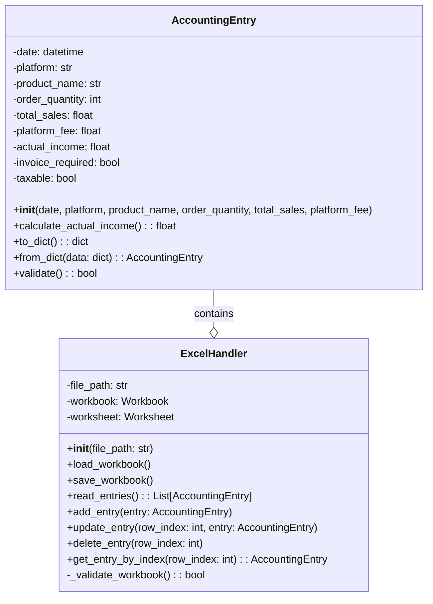

# 記帳自動化系統設計文件

## 系統架構圖



## 類別說明

### AccountingEntry 類別
記帳項目的主要資料結構，包含所有必要的記帳資訊。

#### 屬性
- `date`: 日期 (datetime)
- `platform`: 平台名稱 (str)
- `product_name`: 商品名稱 (str)
- `order_quantity`: 訂單數量 (int)
- `total_sales`: 銷售總額 (float)
- `platform_fee`: 平台手續費 (float)
- `actual_income`: 實收金額 (float)
- `invoice_required`: 是否開發票 (bool)
- `taxable`: 課稅區別 (bool)

#### 方法
- `__init__()`: 建構子，初始化記帳項目
- `calculate_actual_income()`: 計算實收金額
- `to_dict()`: 將物件轉換為字典格式
- `from_dict()`: 從字典格式建立物件
- `validate()`: 驗證資料的正確性

### ExcelHandler 類別
負責處理 Excel 檔案的讀寫操作。

#### 屬性
- `file_path`: Excel 檔案路徑
- `workbook`: 目前開啟的活頁簿
- `worksheet`: 目前使用的工作表

#### 方法
- `__init__()`: 建構子，設定 Excel 檔案路徑
- `load_workbook()`: 載入 Excel 檔案
- `save_workbook()`: 儲存 Excel 檔案
- `read_entries()`: 讀取所有記帳項目
- `add_entry()`: 新增記帳項目
- `update_entry()`: 更新指定的記帳項目
- `delete_entry()`: 刪除指定的記帳項目
- `get_entry_by_index()`: 取得指定索引的記帳項目
- `_validate_workbook()`: 驗證工作簿格式是否正確

## 建議的檔案結構

```
accounting_automation/
├── src/
│   ├── __init__.py
│   ├── models/
│   │   ├── __init__.py
│   │   └── accounting_entry.py
│   ├── handlers/
│   │   ├── __init__.py
│   │   └── excel_handler.py
│   └── utils/
│       ├── __init__.py
│       └── validators.py
├── tests/
│   ├── __init__.py
│   ├── test_accounting_entry.py
│   └── test_excel_handler.py
├── config/
│   └── settings.py
└── main.py
```

## 主要功能流程

1. 初始化系統
   ```python
   excel_handler = ExcelHandler("accounting_data.xlsx")
   excel_handler.load_workbook()
   ```

2. 新增記帳項目
   ```python
   entry = AccountingEntry(
       date=datetime.now(),
       platform="蝦皮",
       product_name="商品A",
       order_quantity=1,
       total_sales=100.0,
       platform_fee=10.0
   )
   excel_handler.add_entry(entry)
   ```

3. 讀取記帳項目
   ```python
   entries = excel_handler.read_entries()
   ```

4. 更新記帳項目
   ```python
   entry = excel_handler.get_entry_by_index(1)
   entry.total_sales = 150.0
   excel_handler.update_entry(1, entry)
   ```

5. 儲存變更
   ```python
   excel_handler.save_workbook()